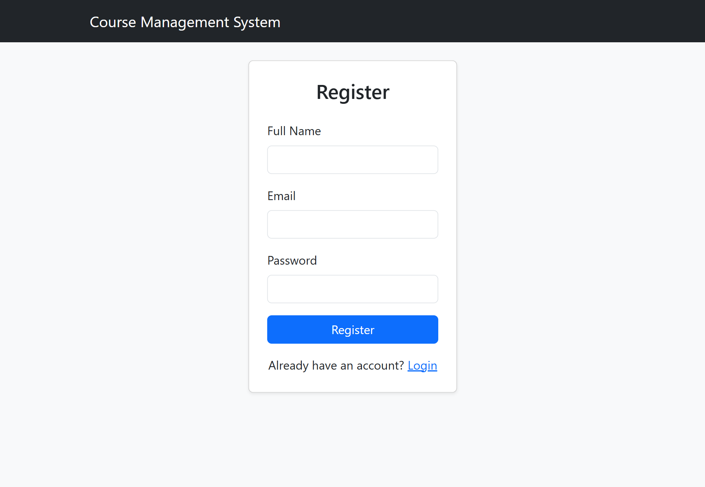
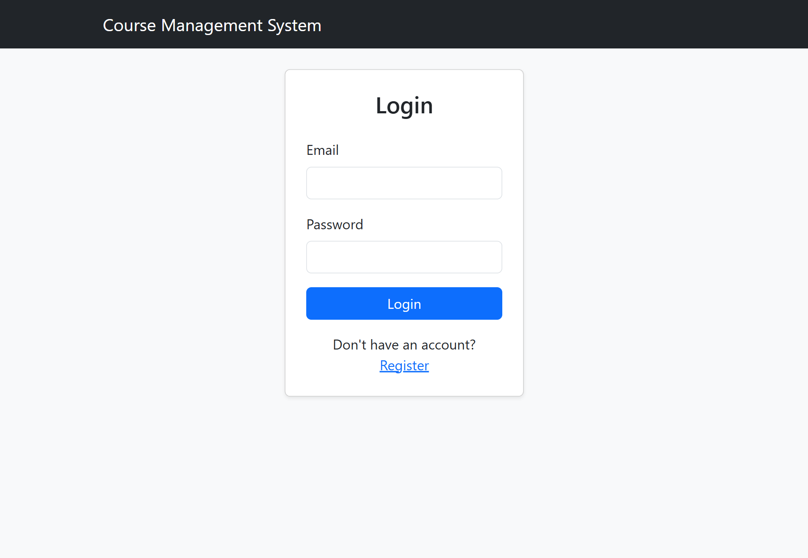
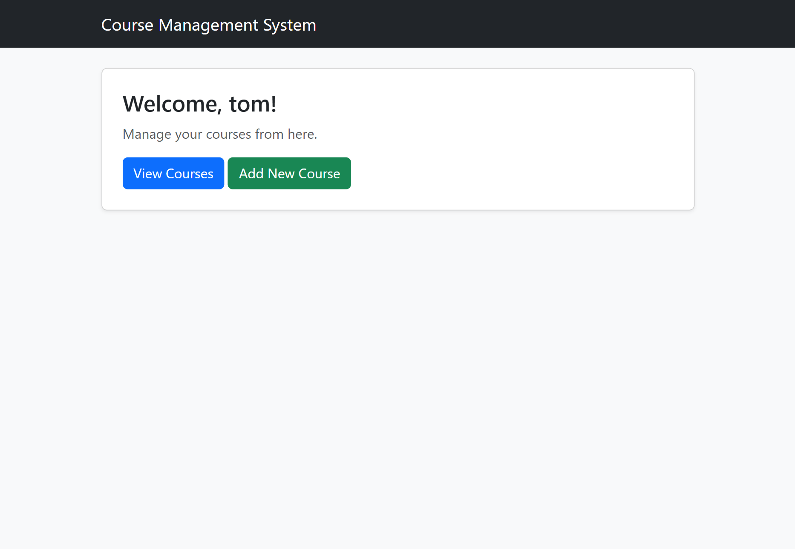
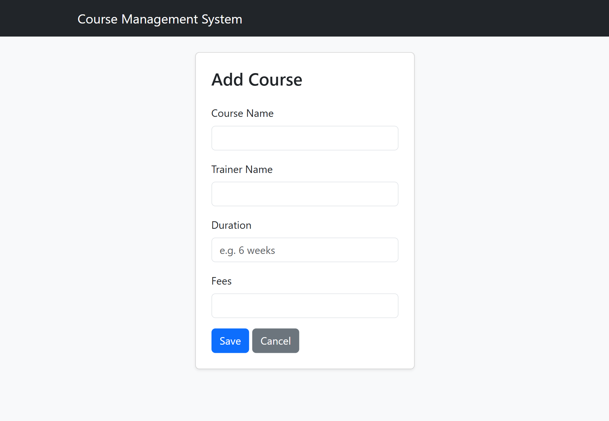
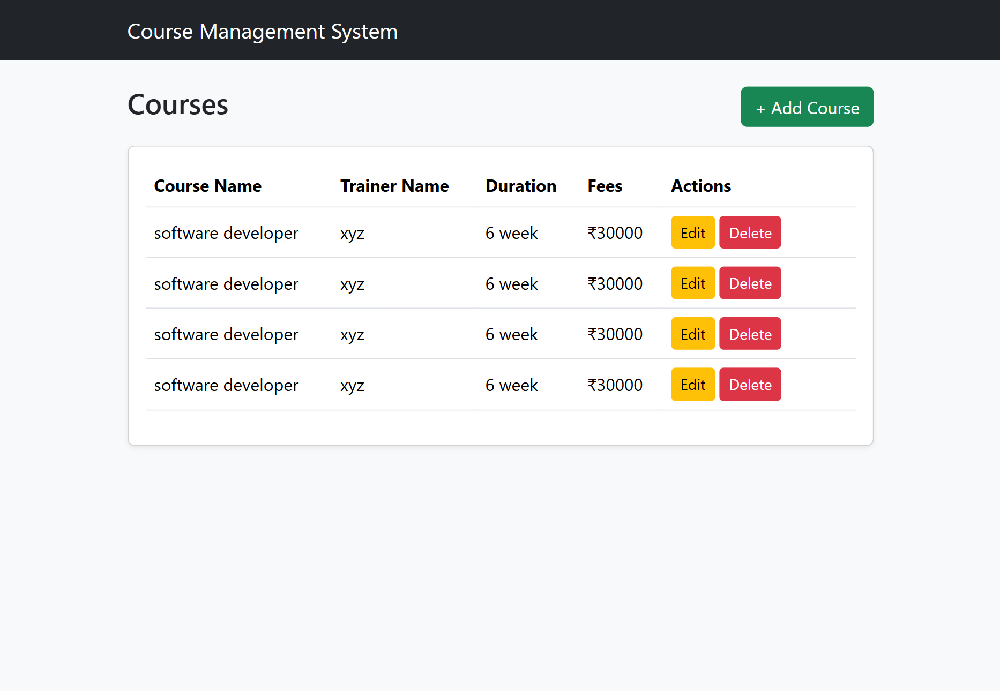
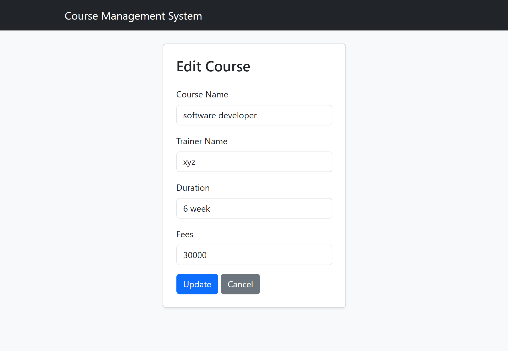
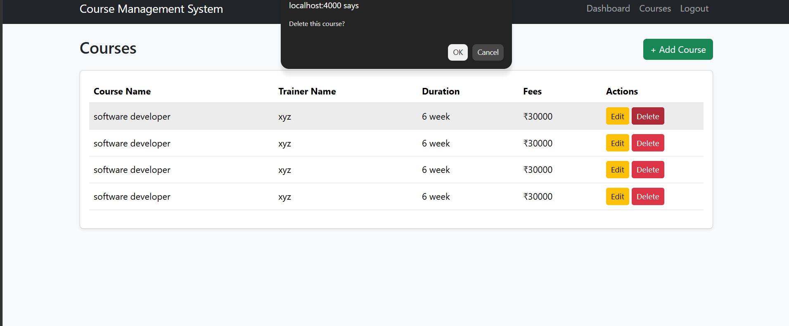
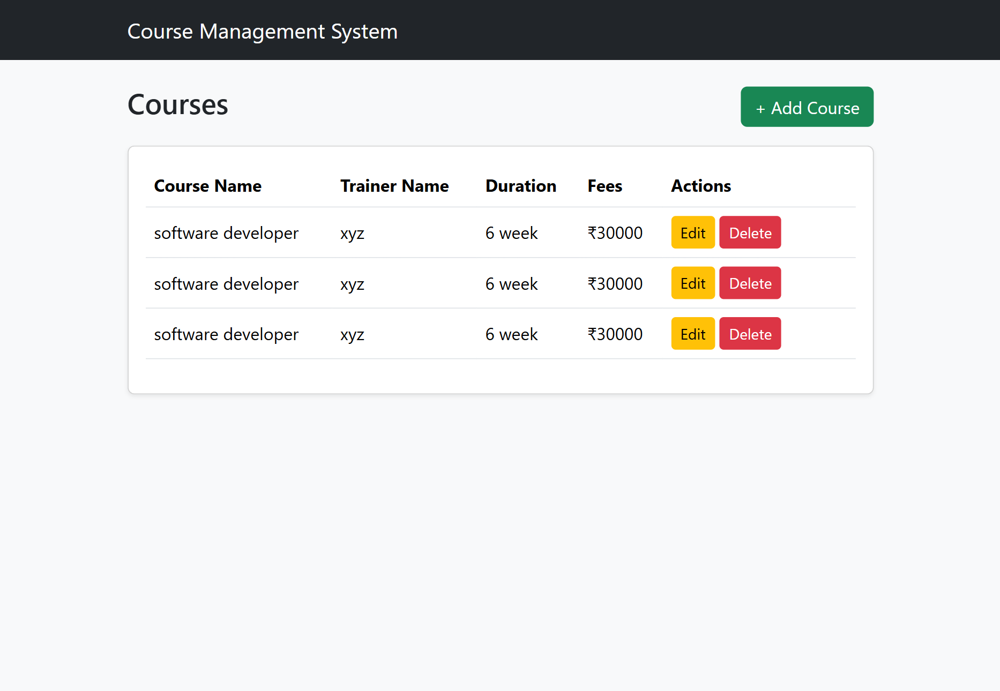
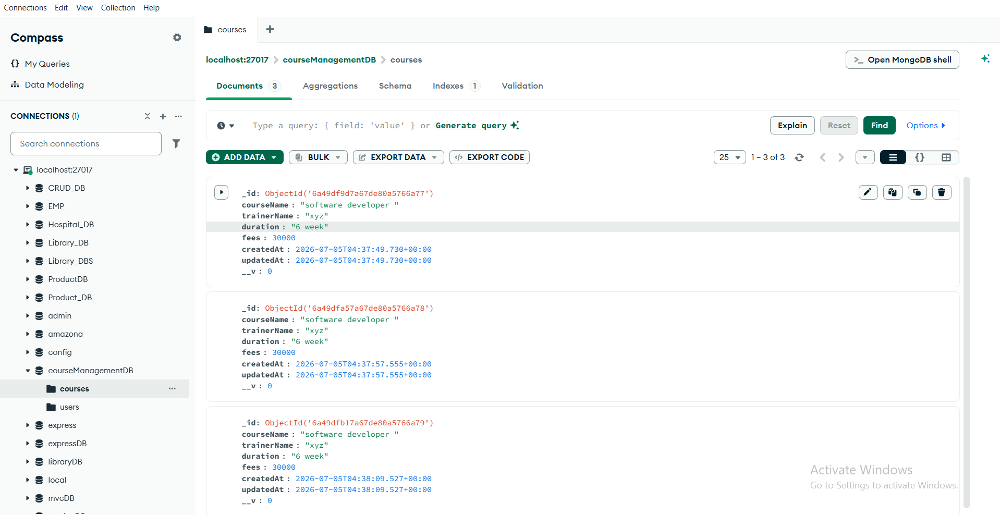

# Online Course Management System

## Objective
A session-based Online Course Management System built with Node.js, Express.js, MongoDB, and EJS following MVC architecture. Users can register, log in, and manage courses (add, view, edit, delete).

## Tech Stack
Node.js · Express.js · MongoDB · Mongoose · EJS · Bootstrap 5 · express-session · bcrypt

## Features
- User Registration & Login (bcrypt password hashing)
- Session-based authentication (express-session)
- Logout
- Course CRUD (Create, Read, Update, Delete)
- Protected routes — redirects to login if not authenticated

## Installation
```bash
git clone https://github.com/sujeetrajbhar681/Course-Management-System.git
cd "Course-Management-System"
npm install
```

## Run
```bash
node app.js
```
Visit: `http://localhost:4000`

## Screenshots

**Register Page**



**Login Page**



**Dashboard**



**Add Course**



**Display Courses**



**Update Course**



**Delete Course (Before)**



**Delete Course (After)**



**MongoDB Collections**



## GitHub Repository
[https://github.com/sujeetrajbhar681/Course-Management-System](https://github.com/sujeetrajbhar681/Course-Management-System)